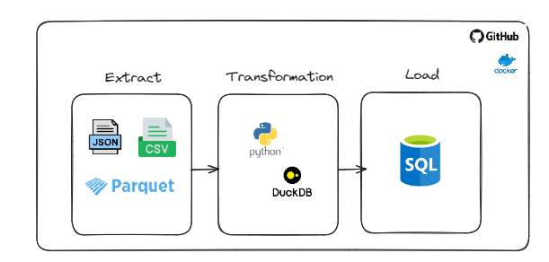

# etl-with-duckdb
projeto de ETL com Python e DuckDB

Extração:
aplicacao que sempre vai checar uma pasta no Google Drive
ao clicar em Processar na pagina do streamlit
o codigo fará o download dos arquivos 
e popula o banco de dados

caso ja tenha sido feito download, exibe a mensagem

Transformação:
calculo do total de vendas

Load:

1.baixar arquivos do g drive
2.listar os arquivos
3. ler os arquivos e transformar em um dataframe

